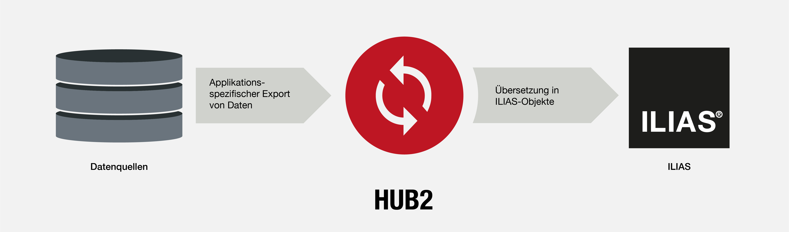

HUB2 Synchronisation
====================



Many institutions already maintain user data or event registrations in external systems and would like to synchronise these with ILIAS. ILIAS itself already offers a variety of standard solutions such as ActiveDirectory, openID or Shibboleth for authentication. In addition, courses can also be created and updated via the existing SOAP interface, but this often involves greater effort for the institution, which has to implement the necessary processes and scripts itself.
With HUB2, sr.solutions offers a simple solution for one-way synchronisation:
- User accounts
- categories
- Courses and groups
- Memberships in Courses and groups
- Organisational units and positions
- ...

More information can be found [here](https://sr.solutions/hub2).

## Installation

### Install Hub2 plugin
Start at your ILIAS root directory

```bash
mkdir -p Customizing/global/plugins/Services/Cron/CronHook
cd Customizing/global/plugins/Services/Cron/CronHook
git clone https://github.com/srsolutionsag/Hub2.git Hub2
```
### Requirements
* ILIAS 5.4 to ILIAS 7
* PHP >=7.0


### ILIAS Plugin SLA
We love and live the philosophy of Open Source Software! Most of our developments, which we develop on behalf of customers or in our own work, we make publicly available to all interested parties free of charge at https://github.com/srsolutionsag.

Do you use one of our plugins professionally? Secure the timely availability of this plugin also for future ILIAS versions by signing an SLA. Find out more about this at https://sr.solutions/plugins.

Please note that we only guarantee support and release maintenance for institutions that sign an SLA.
